##Задание 1 

Скачаем библиотеку *boost*:
`wget https://sourceforge.net/projects/boost/files/boost/1.69.0/boost_1_69_0.tar.gz`
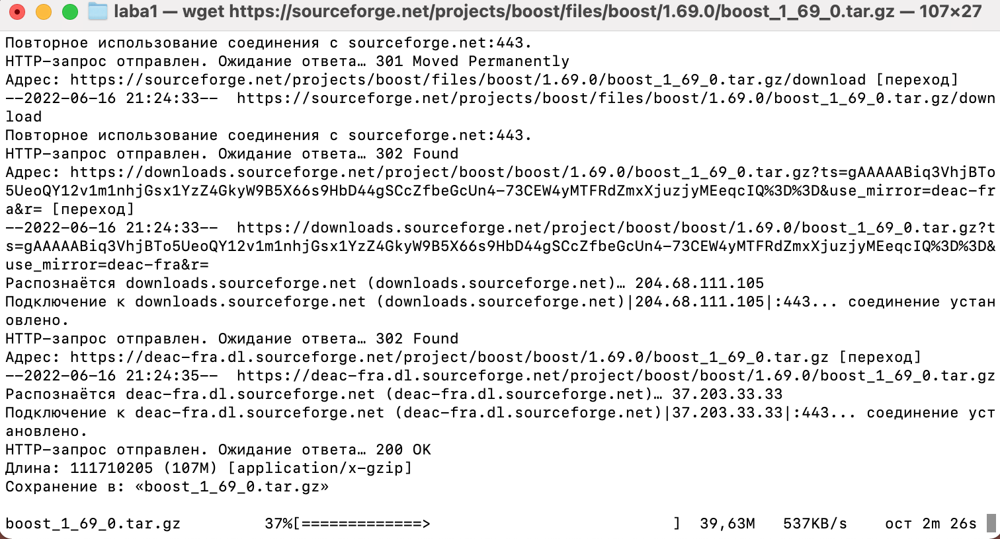

#Задание 2

Разархивируем скачанный архив:
`tar -xvf boost_1_69_0.tar.gz`
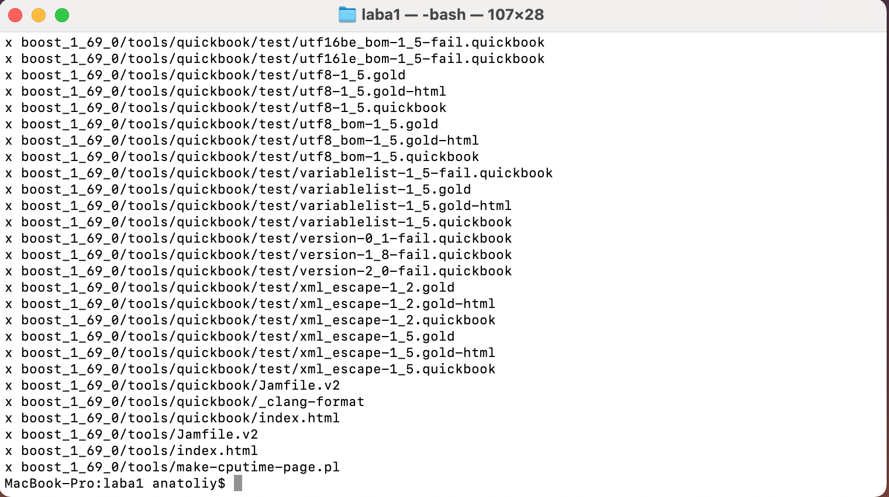

#Задание 3

Подчитаем количество файлов в директории, не включая вложенные:
`tree -L 1`
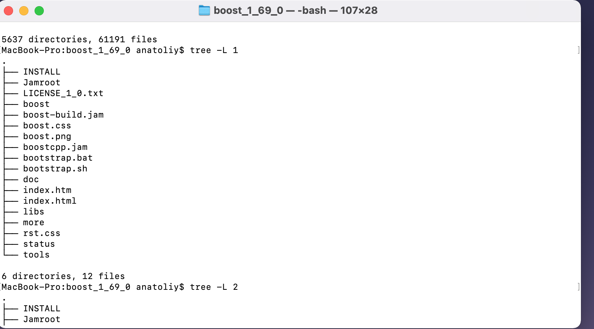

#Задание 4

Подсчитаем вложенные файлы:
`tree`
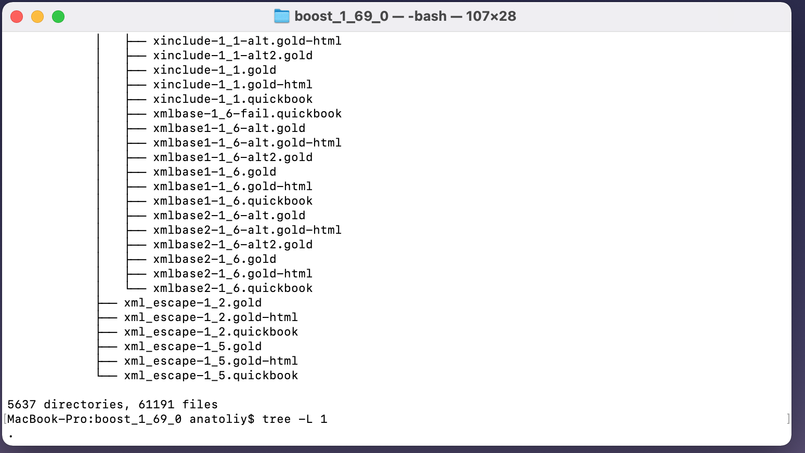

#Задание 5

Подсчитаем количество звголовочных файлов с расширениями: cpp, h, hpp и остальные
`find ~/laba1/boost_1_69_0 -name "*.cpp" | wc -l && find ~/laba1/boost_1_69_0 -name "*.h" | wc -l && find ~/laba1/boost_1_69_0 -name "*.hpp" | wc -l`
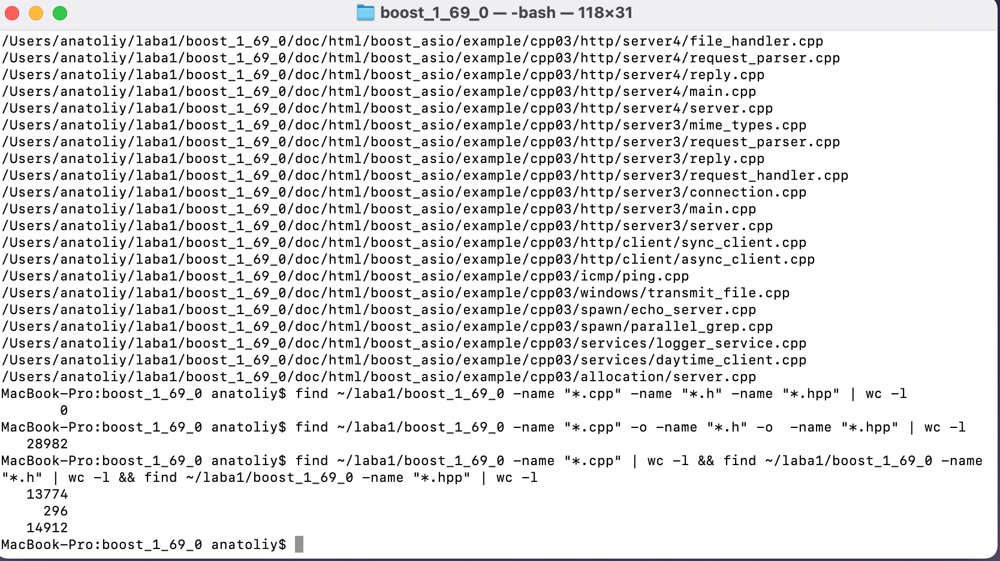
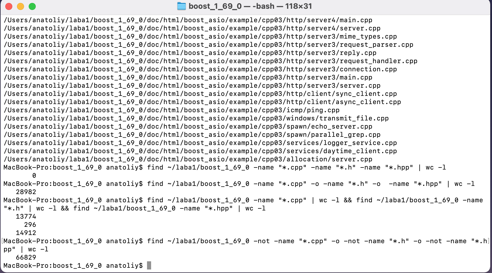

#Задание 6 

Найдем полный путь до файлов с названием any.hpp
`find ~/laba1/boost_1_69_0 -name "any.hpp"`
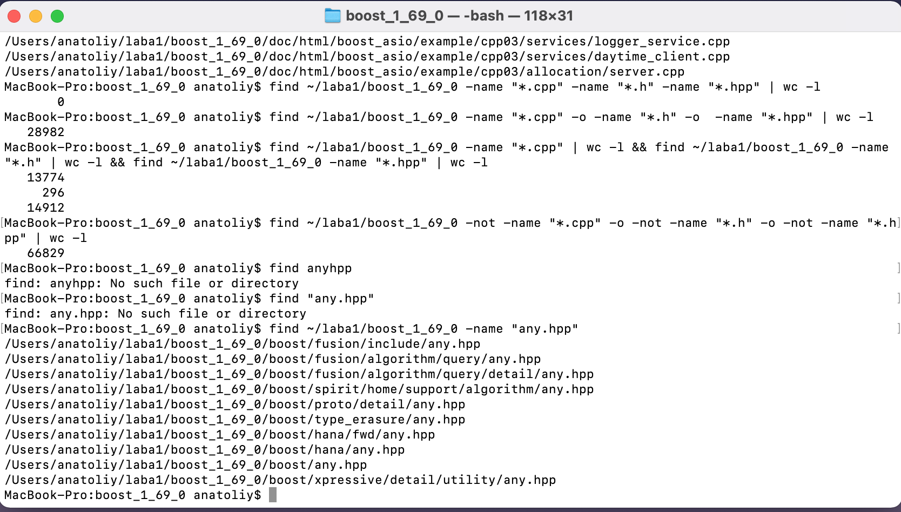

#Задание 7

Выведем в консоль все файлы, где упоминается boost::asio
`find ~/laba1/boost_1_69_0 -type f | xargs grep -i boost::asio`

#Задание 8

Скомпилируем boost
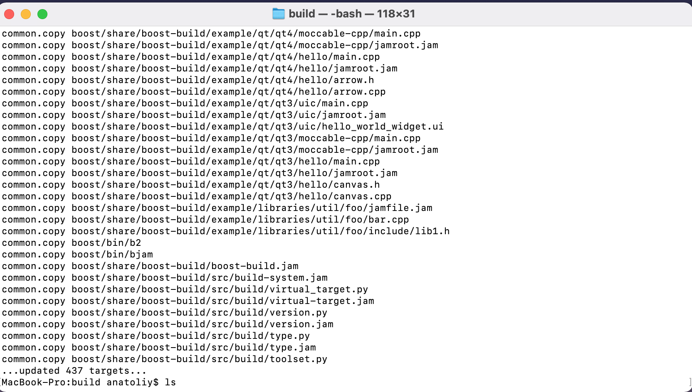

#Задание 9

Перенесем все скомпилированные в предыдущем шаге библиотеки
`mv boost ~/boost-libs`

#Задание 10

Подсчитаем сколько дискового простанства занимает каждый файл
`ncdu ~/boost-libs/share`
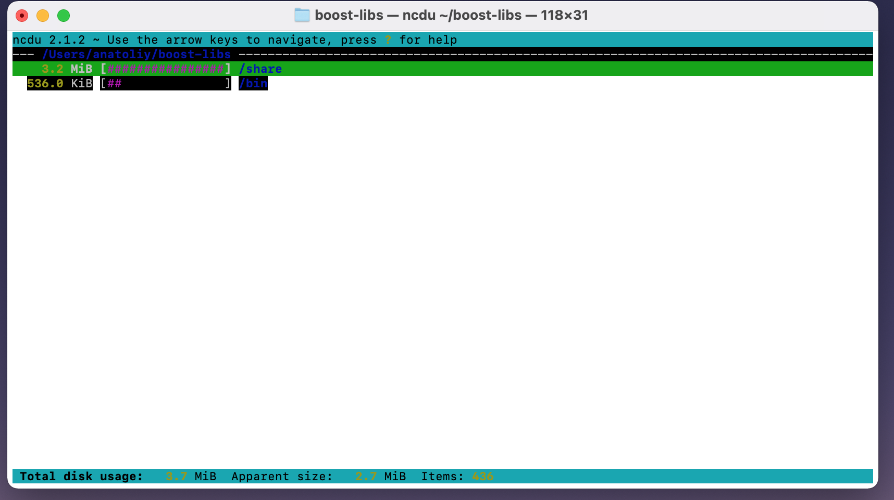

#Задание 11

Найдем 10 самых тяжелых файлов
`find ~/boost-libs/share/boost-build/src/tools -type f -exec du -h {} +|sort -rh | head -n 10`
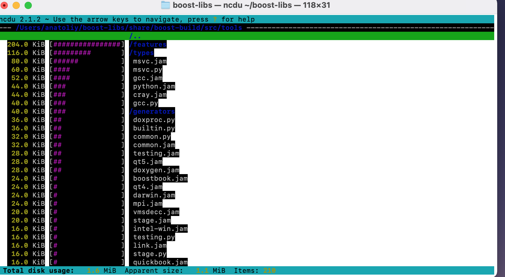
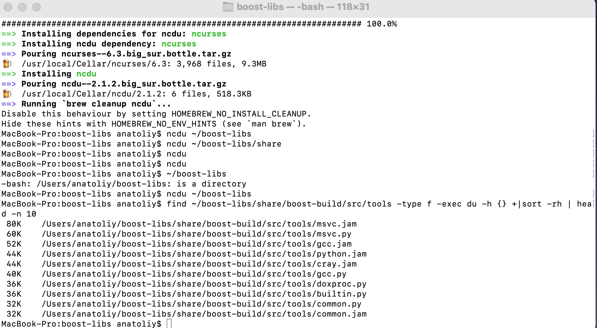
